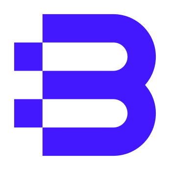

<p align="center">
  <a href="https://blazor.masastack.com" target="_blank">
    
  </a>
</p>

<h1 align="center">MASA Blazor</h1>

<div align="center">

A set of standard basic component libraries based on Material design specifications and BlazorComponent interaction capabilities

[](https://github.com/masastack/Masa.Blazor/blob/develop/LICENSE)
[](https://github.com/masastack/Masa.Blazor/actions/workflows/mirror-gitlab.yml)
[](https://www.nuget.org/packages/Masa.Blazor)
[](https://www.nuget.org/packages/Masa.Blazor)

</div>

English| [简体中文](./README.zh-CN.md)

## 🚀 What is MASA Blazor?

Provide a standard basic component library based on Material design specifications and BlazorComponent's interactive capabilities. Provides preset components for standard scenarios such as layout, frame standard, Loading, and global exception handling. Starting from more practical scenarios, to meet the needs of more users and scenarios, and to minimize the time cost of developers. Shorten the development cycle and improve development efficiency. And provide a set of examples of Web solutions - [MASA Blazor Pro](https://github.com/masastack/Masa.Blazor.Pro) has a variety of common scenes and preset layouts and other exciting content.

## ❓ Why choose MASA Blazor?

MASA Blazor is based on the Material design specification, and each component is carefully designed, with modularity, responsiveness and excellent performance. MASA Blazor is regularly maintained and upgraded by a professional full-time technical team, efficient response speed, diversified solutions, long-term support, and enterprise-level support. At present, it has been used in several well-known companies, and the follow-up MASA Stack product series will continue to be used. In addition to ensuring the quality of the project, it can also continue to add new components and functions. In addition to providing developers with many mid- and Taiwan-based open source projects, MASA Stack, one of its most basic components, MASA Blazor, also hopes to be the most practical component library.

## 🎉 Feature

- Rich components: Contains the basic components of Vuetify 1:1 restoration, as well as many practical preset components and deep integration functions of .Net, including three linkages of Url, breadcrumbs, navigation, advanced search, i18n, etc.
- UI design language: modern design style, excellent UI multi-end experience design
- Professional example: [MASA Blazor Pro](https://github.com/masastack/Masa.Blazor.Pro) provides preset layouts for a variety of common scenarios
- Easy to get started: rich and detailed getting started documents, free video tutorials (in production)
- Active community encouragement: users participate in real-time interaction, make contributions to join us, and build the most open open source community
- Long-term support: full-time team maintenance, long-term support, and enterprise-level support
- Choice of well-known companies: This technology framework has been chosen by many well-known companies, and the MASA Stack product line will continue to be used in the future, and new functions will continue to be added

## 📊 Stats


## 🖥️ Documentation

To check out the docs, visit [docs.masastack.com](https://docs.masastack.com/blazor/introduction/why-masa-blazor)

## 📂 Related projects

- [MASA Blazor Pro（Contains examples of various business scenarios）](https://github.com/masastack/Masa.Blazor.Pro)
- [MASA Template](https://github.com/masastack/MASA.Template)

## 👨‍💻 Local development

### Development environment setup

- Install [.NET SDK 6.0](https://dotnet.microsoft.com/download/dotnet/6.0)
- Install [Visual Studio Code](https://code.visualstudio.com/Download/) or [Visual Studio 2022](https://docs.microsoft.com/en-us/visualstudio/releases/2022/release-notes)

### Clone code

```shell
git clone --recursive https://github.com/masastack/Masa.Blazor.git
cd Masa.Blazor
git submodule foreach git checkout main
```

### Run doc server

```shell
cd docs/Masa.Doc.Server
dotnet run
```

### Visit

Recommended use chrome or edge to visit `http://localhost:5000/`

## 🌐 Supported browsers


### Mobile devices


|         | Chrome    | Firefox   | Safari    | Microsoft Edge |
| ------- | --------- | --------- | --------- | -------------- |
| iOS     | Supported | Supported | Supported | Supported      |
| Android | Supported | Supported | N/A       | Supported      |

### Desktop devices


|         | Chrome    | Firefox   | Safari        | Opera     | Microsoft Edge | Internet Explorer |
| ------- | --------- | --------- | ------------- | --------- | -------------- | ----------------- |
| Mac     | Supported | Supported | Supported     | Supported | N/A            | N/A               |
| Linux   | Supported | Supported | N/A           | N/A       | N/A            | N/A               |
| Windows | Supported | Supported | Not supported | Supported | Supported      | Supported, IE11+  |

> Due to WebAssembly restriction, Blazor WebAssembly doesn't support IE browser, but Blazor Server supports IE 11† with additional polyfills. See official documentation

## 💁‍♂️ Contributing

1. Fork & Clone
2. Create Feature_xxx branch
3. Commit with commit message, like `feat: add MButton`
4. Create Pull Request

Thanks to all the friends who have contributed to this project.

<a href="https://github.com/masastack/Masa.Blazor/graphs/contributors">
    
</a>

## 💬 Interactive

| QQ group                                           | WX public account                                                   | WX Customer Service                                                   |
|:--------------------------------------------------:|:-------------------------------------------------------------------:|:---------------------------------------------------------------------:|
|  |  |  |

## 👥 Development team

The Digital Flash technical team is an efficient, stable and innovative team. The team adheres to the original intention of enriching the Blazor ecosystem, and it is the pursuit of the Digital Flash technical team to continue to work hard to bring a better experience to the developers. Thank you for your support and use.

## 📜 Code of conduct

This project adopts the code of conduct defined in the "Contributors Convention" to clarify the expected behavior of our community. For more information, see  [MASA Stack Community Code of Conduct](https://github.com/masastack/community/blob/main/CODE-OF-CONDUCT.md).

## 📄 License

[](https://github.com/masastack/Masa.Blazor/blob/develop/LICENSE)

Copyright (c) 2021-present Masa.Blazor
