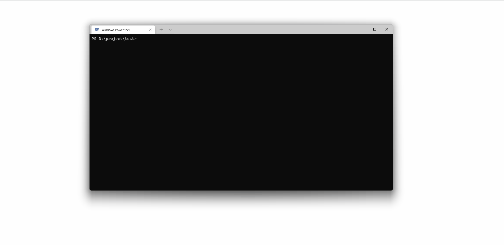

<p align="center">
  <a href="https://masa-blazor-docs-dev.lonsid.cn" target="_blank">
    
  </a>
</p>

<h1 align="center">MASA Blazor</h1>

<div align="center">

一套基于Material设计规范和BlazorComponent的交互能力提供标准的基础组件库

[](https://github.com/BlazorComponent/Masa.Blazor/blob/develop/LICENSE) 
[](https://github.com/BlazorComponent/Masa.Blazor/actions/workflows/mirror-gitlab.yml)
[](https://www.nuget.org/packages/Masa.Blazor)
[](https://www.nuget.org/packages/Masa.Blazor)

</div>

[English](./README.md) | 简体中文

## MASA Blazor是什么？

基于Material设计规范和BlazorComponent的交互能力提供标准的基础组件库。提供如布局、弹框标准、Loading、全局异常处理等标准场景的预置组件。从更多实际场景出发，满足更多用户和场景的需求，最大的减少开发者的时间成本。缩短开发周期提高开发效率。并提供一套Web解决方案示例 - [MASA Blazor Pro](https://github.com/BlazorComponent/Masa.Blazor.Pro) 有多种常见场景和预设布局等精彩内容。


## 为什么选择MASA Blazor？

MASA Blazor 基于Material设计规范，每一个组件都经过精心设计，具有模块化、响应式和优秀的性能。MASA Blazor 是由一支专业的全职技术团队进行定期维护升级，高效的响应速度，多元化的解决方案，长期提供支持，并提供企业级支持。目前已在几家知名企业使用，后续MASA Stack产品系列也将持续使用，除了可以保证项目质量，还可以持续的增加新的组件和功能。MASA Stack除了为开发者提供众多中台类开源项目，其最基础的组成部分之一MASA Blazor也希望可以打造成最实用的组件库。


## 特性

- 丰富组件：包含Vuetify 1:1还原的基础组件，以及很多实用的预置组件和.Net深度集成功能，包括Url、面包屑、导航三联动，高级搜索，i18n等
- UI设计语言：设计风格现代，UI 多端体验设计优秀
- 专业示例：[MASA Blazor Pro](https://github.com/BlazorComponent/Masa.Blazor.Pro) 提供多种常见场景的预设布局
- 简易上手：丰富详细的上手文档，免费的视频教程（制作中）
- 社区活跃鼓励：用户参与实时互动，做出贡献加入我们，构建最开放的开源社区
- 长期支持：全职团队维护，长期提供支持，并提供企业级支持
- 知名企业选择：该技术框架被多家知名企业选择使用，未来MASA Stack产品线也将一直使用，持续增加新功能

# 统计


## 快速使用

### 开发环境搭建

- 安装[.NET SDK 6.0](https://dotnet.microsoft.com/download/dotnet/6.0)
- 安装[Visual Studio Code](https://code.visualstudio.com/Download/)或[Visual Studio 2022](https://docs.microsoft.com/en-us/visualstudio/releases/2022/release-notes)

### CLI

**Install Template**

```c#
dotnet new --install Masa.Template
```

**Create Project**

```shell
dotnet new masabp -o Masa.Test
```

- Blazor WebAssembly

```shell
dotnet new masabp --mode Wasm -o Masa.TestWasm
```

- Blazor RCL

```shell
dotnet new masabp --mode ServerAndWasm -o Masa.TestRcl
```

**Go to the Server project directory**

```shell
cd Masa.Test\Masa.Test.Server
```

**Run**

```shell
dotnet run
```





### 现有项目

- 安装Nuget包

```shell
dotnet add package Masa.Blazor
```

- 将 Masa.Blazor 的相关服务添加到`Startup.ConfigureServices`:

```c#
services.AddMasaBlazor();
```

- 在 `wwwroot/index.html`(WebAssembly) 或 `Pages/_Host.cshtml`(Server) 中引入样式、字体、脚本:

```html
<html lang="en">
	<head>
		<!--Style-->
		<link href="_content/Masa.Blazor/css/masa-blazor.css" rel="stylesheet">
		<link href="_content/Masa.Blazor/css/masa-extend-blazor.css" rel="stylesheet">
		<!--Font-->
		<link href="https://cdn.jsdelivr.net/npm/@("@mdi")/font@5.x/css/materialdesignicons.min.css" rel="stylesheet">
		<link href="https://fonts.googleapis.com/css?family=Material+Icons" rel="stylesheet">
		<link href="https://use.fontawesome.com/releases/v5.0.13/css/all.css" rel="stylesheet">	
	</head>
	<body>
		<!--Script (try to put it at the end of the body)-->
		<script src="_content/BlazorComponent/js/blazor-component.js"></script>
	</body>
</html>
```

- 在`_Imports.razor`文件中加入命名空间:

```c#
@using Masa.Blazor
@using BlazorComponent
```

- 修改`Shared/MainLayout.razor`文件，让MApp成为根元素：

```html
<MApp>
	//其它布局内容
</MApp>
```

> 更多详情 ：[https://blazor.masastack.com/](https://blazor.masastack.com/ "https://blazor.masastack.com/")


## 本地开发

### 开发环境搭建

- 安装 [.NET SDK 6.0](https://dotnet.microsoft.com/download/dotnet/6.0)
- 安装 [Visual Studio Code](https://code.visualstudio.com/Download/) or [Visual Studio 2022](https://docs.microsoft.com/en-us/visualstudio/releases/2022/release-notes)

### 克隆代码

```shell
git clone git@github.com:BlazorComponent/Masa.Blazor.git
cd Masa.Blazor/src
git clone git@github.com:BlazorComponent/BlazorComponent.git
```

### 运行文档站点

```shell
cd Doc/Masa.Blazor.Doc.Server
dotnet run
```

### 访问

推荐使用 chrome 或 edge 访问 `http://localhost:5000/`


## 相关资源

- [Blazor 官方文档](https://docs.microsoft.com/zh-cn/aspnet/core/blazor/?WT.mc_id=DT-MVP-5004174)
- [生成 Blazor Web 应用](https://docs.microsoft.com/zh-cn/learn/modules/build-blazor-webassembly-visual-studio-code/?WT.mc_id=DT-MVP-5004174)
- [什么是 Blazor](https://docs.microsoft.com/zh-cn/learn/modules/build-blazor-webassembly-visual-studio-code/2-understand-blazor-webassembly?WT.mc_id=DT-MVP-5004174)
- [练习 - 配置开发环境](https://docs.microsoft.com/zh-cn/learn/modules/build-blazor-webassembly-visual-studio-code/3-exercise-configure-enviromnent?WT.mc_id=DT-MVP-5004174)
- [Blazor 组件](https://docs.microsoft.com/zh-cn/learn/modules/build-blazor-webassembly-visual-studio-code/4-blazor-components?WT.mc_id=DT-MVP-5004174)
- [练习 - 添加组件](https://docs.microsoft.com/zh-cn/learn/modules/build-blazor-webassembly-visual-studio-code/5-exercise-add-component?WT.mc_id=DT-MVP-5004174)
- [数据绑定和事件](https://docs.microsoft.com/zh-cn/learn/modules/build-blazor-webassembly-visual-studio-code/6-csharp-razor-binding?WT.mc_id=DT-MVP-5004174)
- [练习 - 数据绑定和事件](https://docs.microsoft.com/zh-cn/learn/modules/build-blazor-webassembly-visual-studio-code/7-exercise-razor-binding?WT.mc_id=DT-MVP-5004174)
- [总结](https://docs.microsoft.com/zh-cn/learn/modules/build-blazor-webassembly-visual-studio-code/8-summary?WT.mc_id=DT-MVP-5004174)


## 相关项目

- [BlazorComponent（无样式的底层组件框架）](https://github.com/BlazorComponent/BlazorComponent)
- [MASA Blazor Pro（包含各种业务场景的示例）](https://github.com/BlazorComponent/Masa.Blazor.Pro)


## 浏览器支持


### 移动设备


|         |  Chrome     |  Firefox     |  Safari     | Microsoft Edge |
| ------- | ---------   | ---------    | ------      | -------------- |
| iOS     | Supported   | Supported    | Supported   | Supported      |
| Android | Supported   | Supported    | N/A         | Supported      |

### 桌面设备


|         | Chrome    | Firefox   | Safari        | Opera     | Microsoft Edge | Internet Explorer |
| ------- | --------- | --------- | ------------- | --------- | -------------- | ----------------- |
| Mac     | Supported | Supported | Supported     | Supported | N/A            | N/A               |
| Linux   | Supported | Supported | N/A           | N/A       | N/A            | N/A               |
| Windows | Supported | Supported | Not supported | Supported | Supported      | Supported, IE11+  |

> 由于 [WebAssembly](https://webassembly.org) 的限制，Blazor WebAssembly 不支持 IE 浏览器，但 Blazor Server 支持 IE 11†。 详见[官网说明](https://docs.microsoft.com/zh-cn/aspnet/core/blazor/supported-platforms?view=aspnetcore-3.1&WT.mc_id=DT-MVP-5003987)。


## 如何贡献

1. Fork & Clone
2. Create Feature_xxx branch
3. Commit with commit message, like `feat:add MButton`
4. Create Pull Request

如果你希望参与贡献，欢迎 [Pull Request](https://github.com/BlazorComponent/Masa.Blazor/pulls)，或给我们 [报告 Bug](https://github.com/BlazorComponent/Masa.Blazor/issues/new) 。


## 贡献者

感谢所有为本项目做出过贡献的朋友。

<a href="https://github.com/BlazorComponent/Masa.Blazor/graphs/contributors"> 
     
</a>


## 交流

QQ群 | 微信公众号 | 微信客服
:---:|:---:|:---:
 |  | 


## 开发团队

数闪技术团队，是一支高效，稳定，创新的团队。团队秉承着丰富Blazor生态的初心，去不断努力，为开发人员带来更好的体验是数闪技术团队的追求。感谢各位的支持和使用。


## 行为准则

本项目采用了《贡献者公约》所定义的行为准则，以明确我们社区的预期行为。更多信息请见 [MASA Stack Community Code of Conduct](https://github.com/masastack/community/blob/main/CODE-OF-CONDUCT.md).


## 许可声明

[](https://github.com/BlazorComponent/Masa.Blazor/blob/develop/LICENSE) 

Copyright (c) 2021-present Masa.Blazor 
